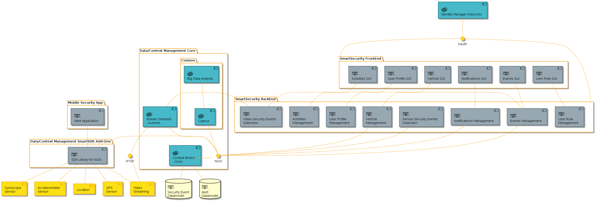

# Documentation of the Smart Security Application
 
## Requirements

Current version of the system has the next hardware requirements for pre-processing.

    At least 32 GB of RAM.
    Intel core i7, 3.4 Ghz.
    At least 500 Gb of hd (Recommended 1TB). 

Software requirements:

    Ubuntu 14.04 LTS
    Kurento Media Server 6.1.1
    Maven 3.0.5
    Java 1.8.0.131
    Web2py
    OpenCV 2.4

## Architecture

The Smart Security architecture is being developed to detect security risk events based on the video stream acquisition from a set of sensors (e.g. video cameras) connected to a network. It is then analyzed to detect, label, store and highlight security-relevant events automatically.

To capture the incoming video streaming from IP cameras we are using Kurento GE through the Kurento Media Server (KMS). The KMS is based on Media Elements (ME) and Media Pipelines. The former consists of modules that perform a specific action on a media stream receiving or sending media from other elements, the latter is a chain of media elements. For the security application we have developed  a set of filters (ME) capable of subtracting objects (people and vehicles) in motion within a scene, classify such objects and track them. From this information, we are developing algorithms that can detect security events. All the data generated from the stream processing is sent to the Orion Context Broker through its connection with Kurento. Furthermore, the data from the detected security events is stored into Cosmos Big Data GE.

## Backend Smart Security Application

The Back End component is the manager of the streaming coming from the cameras. Interatction with the interface is required in order able or disable capabilities and to notify to the user the events detected.

The application's main contribution focus on the development of algorithms to detect differente types of visual events. Current version is able to detect movement (based on SubSENSE for blob detetecion), people and vehicles.

## Frontend Smart Security Application

In order to visualize all the information generated by the Backend a GUI based on Web2py is developed. Main functionalities are regarding to Events (person and vehicle), User profile and notifications management. The GUI designed allows to the user visualize the straming and the events detected online. Also a complete search functionalitie is being developed.

 

