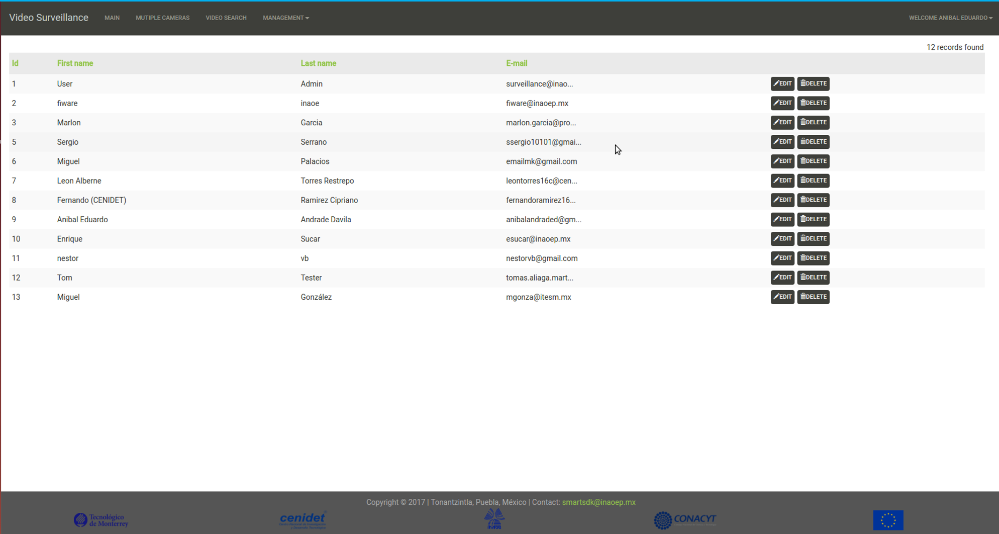

# Manual of ViVA
 
## Requirements

For an optimal performance, `Google Chrome` browser is recommended.  

## Interface

The Graphical User interface was build using the `Web2Py` Framework, which allows the fast development of Web Applications with Python language as its core. This framework uses the MVC (Model-View-Controller) architectural pattern to build up web applications.

Current prototype offers five differents views to the user: `Login`, `Main`, `Multiple Cameras`, `Search` and `Management`.

## User registration

Login page forbids the access of unauthorized users to the system, blocking both view and management privileges. In order to be a user of the system a sign up process is required by the system administrator. 

To register a new user:

1. Clik on the `Login` menu and select the the `Sign up` option (right upper corner of the Login view).

2. In the `Login` view we must indicate the user name and the password of the new user.

 
The information is sent to the system administrator to authorize the acces to the new user.
 
## Sign in

Once that we are a registered user, we are able to acces to the system using also the `Login` view.

To acces the system:

1. Click on the `Login` option and select the the `Log in` option (right upper corner of the `Login` view).

2. In the `Login` view we must indicate the user name and the password of the user.

## Recording video by motion

By default the system is able to automatic video recording by motion detection in the scene.

## Visualize a single camera

In order to visualize a specific camera:

1. Click on the `Main` tab

2. When the `Main` view is visualized, in the bottom scrollbar select the camera.

## Visualize the last events detected (In progress).

Every activity detected by the system is reported and visualized to the user. To see the last activity detected:

1. Click on the `Main` tab.

2. Go to the `Last Activities` textbox (right side of the Main View ).

## Vizualize multiple cameras

For a general overview, the system is capable to show all the cameras in the `Multiple Cameras` View. 
 
1. Click on the `Multiple Cameras` tab.

2. Select the `Grid` option

3. All the cameras registered in the system are visible.

## Map visualization

1. Click on the `Multiple Cameras` tab.

2. Select the `Map` option

3. All the cameras registered in the system are visible on map.

The pin color of the camera shows the priority of the last alerts received. Left click on the pin to see an small view of the video camera streaming. Right click onf the pin to see a list of the last alerts received.

 
## Search

The system allows the user to search segments of video associated with events detected. Two main criteria define the search: by annotation or by image file containing a face.

### Searching by Annotation (Filters)

This  search option contains a form to search by event type (Person or vehicle detected), by date of detection, and/or by the id of the camera in which the event was detected.

In order to search videos by Annotation:

1. Click on the `Search` tab.

2. Select the `Filters` radio button.

3. On the `Search` view define the search criteria.

- `Event Type`: Select the type o event that you want to search. If no one option is selected all type of events will be shown.

- `Camera id`: Select the camera id desired.

- `Date`: Two calendars are available in order to define a date criteria (Start and End).

4. Once the criteria is defined, click on the `Filter Events` button.

5. The search result is visualized on the bottom textbox.

### Searching by Image File (Face)

This search option allows to the user search a person by face.

In order to search a person (by face) in the video repository:

1. Click on the `Search` tab.

2. Select the `Face` radio button.

3. Click on the `File` button.

4. Select the file containing the face of the person to search.

5. Once the file is selected, click on the `Filter Events` button.

6. The search result is visualized on the bottom textbox.

## Settings

To configure how the system higlight the event detected on the streaming:

1. Click on the `Management` menu.

2. Select the `Filters` option.

3. In the `Configure Filters` section, select the `Event`, `Text tag` and `Color` desired to visualize on the streaming when the event is detected.

4. Click on the `Submit` button.

## Cameras management

Curent version of the system only supports edition of camera info.

### Edit cameras

1. Click  on the `Management` menu.

2. Select the `Cameras` option.

3. In the `Cameras Management` section, click on the `Edit` button.

4. To edit the `id` of the new camera.

5. To edit the rstp `url` of the new camera.

6. Click on the `Submit` button.

7. Click on the `Apply Changes` button.

